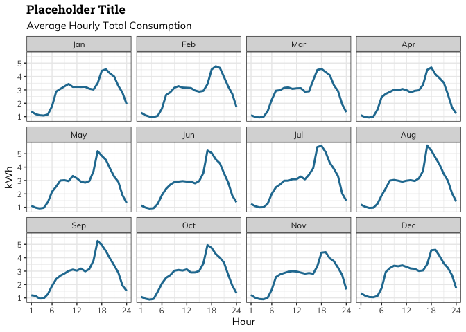
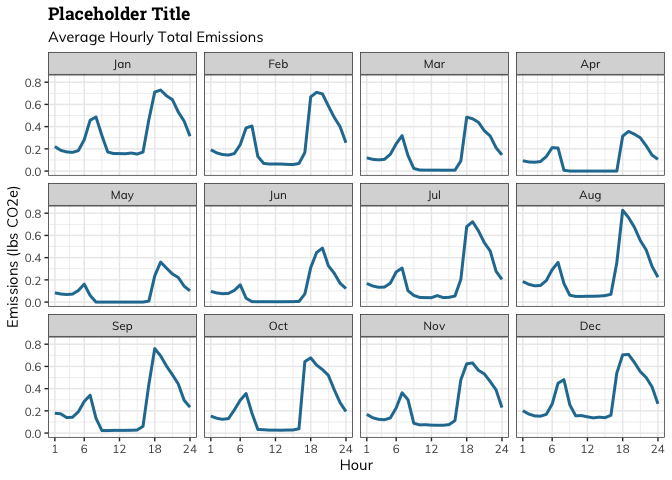
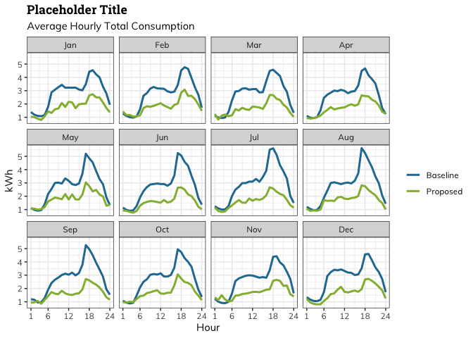
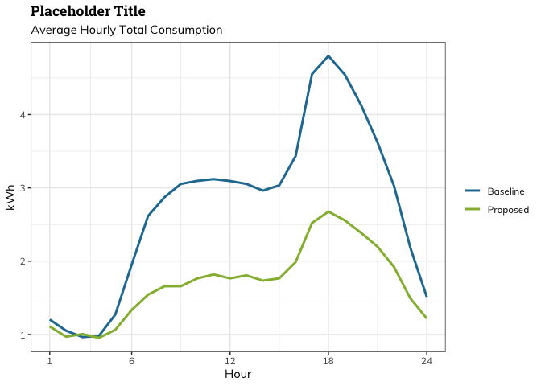
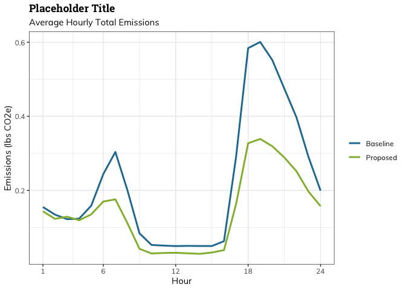
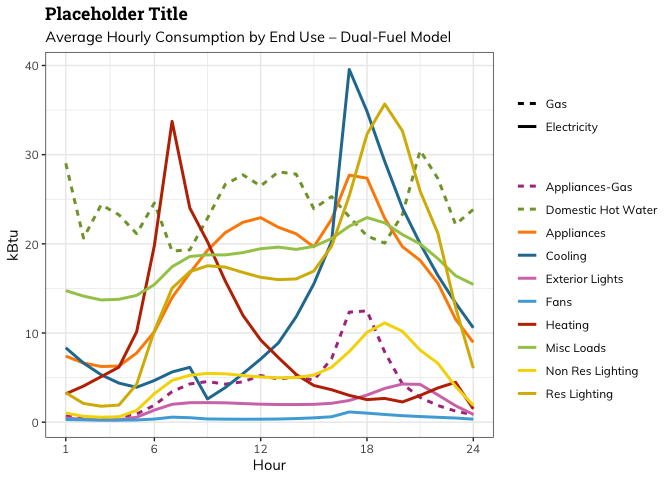

<!-- README.md is generated from README.Rmd. Please edit that file -->
# Resource Refocus R Data Visualization Package for 8760 Building End-Use Level Data 

## Guide to Using Functions

### Set Up

Run the following code to install the package

``` r
# install.packages("devtools")
# devtools::install_github("jkeast/ResourceRefocus")

library(ResourceRefocus)
```

To ensure the fonts are consistent with the Resource Refocus style guide, make sure the "Muli" and "Roboto" fonts are installed to your computer and install and library the `extrafont` package. Then, for each font family run `ttf_import("[Path to font]")` and finally

``` r
extrafont::loadfonts(device = "pdf")
```

<!-- badges: start -->
<!-- badges: end -->
### Getting Data Ready for Plotting

I wrote a couple of functions to transform model outputs into a workable format for plotting:

-   `simple_cap()` capitalizes the first letter of each word (for labeling purposes)
-   `clean_enduse()` modifies the names of enduse columns to be visually appealing (for labeling purposes)
-   `to_remove()` determines if there is an enduse equalling sum of others and removes it
-   `convert()` converts energy from original units to kWh
-   `clean_data()` utilizes the above functions and some existing R functions to make the data completely ready for plotting

`clean_data()` is automatically called by all plotting functions, but can also be used on its own if ever helpful. To utilize it, call `clean_data()` with the path to a csv of your data. E.g:

``` r
library(ResourceRefocus)

data <- clean_data(baseline_csv)
#> 
#> ── Column specification ────────────────────────────────────────────────────────
#> cols(
#>   `Date/Time` = col_character(),
#>   `Misc_Loads:InteriorEquipment:Electricity [J](Hourly)` = col_double(),
#>   `Electricity:Facility [J](Hourly)` = col_double(),
#>   `Res_lighting:InteriorLights:Electricity [J](Hourly)` = col_double(),
#>   `NonRes_lighting:InteriorLights:Electricity [J](Hourly)` = col_double(),
#>   `ExteriorLights:Electricity [J](Hourly)` = col_double(),
#>   `Cooling:Electricity [J](Hourly)` = col_double(),
#>   `Heating:Electricity [J](Hourly)` = col_double(),
#>   `Fans:Electricity [J](Hourly)` = col_double(),
#>   `Appliances:InteriorEquipment:Electricity [J](Hourly)` = col_double(),
#>   `DHW:NaturalGas [J](Hourly)` = col_double()
#> )
#> `clean_data()` converting energy from joules to kWh. Override with conversion_factor if input in other units.
#> `to_remove()` removing row summing electric end uses from data.
head(data)
#> # A tibble: 6 x 6
#> # Groups:   Hour, month, enduse [6]
#>    Hour month enduse             fuel           kWh sum_kWh
#>   <dbl> <fct> <chr>              <chr>        <dbl>   <dbl>
#> 1     1 Jan   Appliances         Electricity 1.99    63.5  
#> 2     1 Jan   Cooling            Electricity 0.178    5.69 
#> 3     1 Jan   Domestic Hot Water NaturalGas  1.99    63.5  
#> 4     1 Jan   Exterior Lights    Electricity 0.189    6.05 
#> 5     1 Jan   Fans               Electricity 0.0177   0.568
#> 6     1 Jan   Heating            Electricity 0.851   27.2
```

In addition to the path to a csv, `clean_data()` has a number of other arguments:

-   `by_month`: designates whether to summarize data by month (the default) or omit month (NULL)
-   `by_enduse`: designates whether to summarize data by enduse (the default) or omit enduse (NULL)
-   `by_hour`: designates whether to summarize data by hour (the default) or omit hour (NULL)
-   `by_fuel`: designates whether to summarize data by fuel (the default) or omit fuel (NULL)

Each of these arguments shape how granular the summaries are. The default for the function is to include all these variables, so you need to indicate which you want the function to NOT consider. For example, if you want to just focus on energy usage by month -- ignoring end-use, hour of the day, and fuel -- you can set `by_enduse`, `by_hour`, and `by_fuel` to NULL.

``` r
data <- clean_data(baseline_csv, by_enduse = NULL, by_hour = NULL, by_fuel = NULL)
head(data)
#> # A tibble: 6 x 3
#>   month   kWh sum_kWh
#>   <fct> <dbl>   <dbl>
#> 1 Jan    2.84  19611.
#> 2 Feb    2.75  16657.
#> 3 Mar    2.74  18351.
#> 4 Apr    2.67  17285.
#> 5 May    2.74  18370.
#> 6 Jun    2.70  17520.
```

You can also use these arguments in conjunction, say to focus on end-use and hour of the day:

``` r
data <- clean_data(baseline_csv, by_fuel = NULL, by_month = NULL)
head(data)
#> # A tibble: 6 x 4
#> # Groups:   Hour [1]
#>    Hour enduse                kWh sum_kWh
#>   <dbl> <chr>               <dbl>   <dbl>
#> 1     1 Appliances         1.88     688. 
#> 2     1 Cooling            1.09     399. 
#> 3     1 Domestic Hot Water 1.88     688. 
#> 4     1 Exterior Lights    0.140     51.3
#> 5     1 Fans               0.0358    13.1
#> 6     1 Heating            0.224     82.2
```

`clean_data()` also passes a `conversion_factor` argument to the `convert()` function. This is what you should use if the source data is in some units other than Joules --- just supply `clean_data()` with the correct factor to convert from the original units to kWh. For example, say our original units are kBtu. We would want to divide the energy by 3.412 to convert to kWh:

``` r
data <- clean_data(baseline_csv, conversion_factor = 3.412)
#> 
#> ── Column specification ────────────────────────────────────────────────────────
#> cols(
#>   `Date/Time` = col_character(),
#>   `Misc_Loads:InteriorEquipment:Electricity [J](Hourly)` = col_double(),
#>   `Electricity:Facility [J](Hourly)` = col_double(),
#>   `Res_lighting:InteriorLights:Electricity [J](Hourly)` = col_double(),
#>   `NonRes_lighting:InteriorLights:Electricity [J](Hourly)` = col_double(),
#>   `ExteriorLights:Electricity [J](Hourly)` = col_double(),
#>   `Cooling:Electricity [J](Hourly)` = col_double(),
#>   `Heating:Electricity [J](Hourly)` = col_double(),
#>   `Fans:Electricity [J](Hourly)` = col_double(),
#>   `Appliances:InteriorEquipment:Electricity [J](Hourly)` = col_double(),
#>   `DHW:NaturalGas [J](Hourly)` = col_double()
#> )
#> `clean_data()` converting energy with conversion factor of 3.412, dividing original energy values by this factor. Override with conversion_factor if incorrect.
#> `to_remove()` removing row summing electric end uses from data.
head(data)
#> # A tibble: 6 x 6
#> # Groups:   Hour, month, enduse [6]
#>    Hour month enduse             fuel             kWh   sum_kWh
#>   <dbl> <fct> <chr>              <chr>          <dbl>     <dbl>
#> 1     1 Jan   Appliances         Electricity 2094375. 67020004.
#> 2     1 Jan   Cooling            Electricity  187742.  6007750.
#> 3     1 Jan   Domestic Hot Water NaturalGas  2094375. 67020004.
#> 4     1 Jan   Exterior Lights    Electricity  199399.  6380760.
#> 5     1 Jan   Fans               Electricity   18724.   599180.
#> 6     1 Jan   Heating            Electricity  898006. 28736193.
```

As you can see, the function also sends a message reminding you which conversion factor you used.

`clean_data()` also has an `emissions_conversions` argument for the path to csv with hourly tonne CO2-e/MWh and tonne CO2-e/therm conversion factors (see inst/extdataGHG\_index\_E3\_2030.csv for example). If utilized, `clean_data()` will also return emissions summaries.

``` r
data <- clean_data(baseline_csv, emissions_conversions = CO2_conversions)
#> 
#> ── Column specification ────────────────────────────────────────────────────────
#> cols(
#>   `Date/Time` = col_character(),
#>   `Misc_Loads:InteriorEquipment:Electricity [J](Hourly)` = col_double(),
#>   `Electricity:Facility [J](Hourly)` = col_double(),
#>   `Res_lighting:InteriorLights:Electricity [J](Hourly)` = col_double(),
#>   `NonRes_lighting:InteriorLights:Electricity [J](Hourly)` = col_double(),
#>   `ExteriorLights:Electricity [J](Hourly)` = col_double(),
#>   `Cooling:Electricity [J](Hourly)` = col_double(),
#>   `Heating:Electricity [J](Hourly)` = col_double(),
#>   `Fans:Electricity [J](Hourly)` = col_double(),
#>   `Appliances:InteriorEquipment:Electricity [J](Hourly)` = col_double(),
#>   `DHW:NaturalGas [J](Hourly)` = col_double()
#> )
#> 
#> ── Column specification ────────────────────────────────────────────────────────
#> cols(
#>   `Date/Time` = col_character(),
#>   `tonne CO2-e/MWh` = col_double(),
#>   `tonne CO2-e/therm` = col_double()
#> )
#> Joining, by = "Date/Time"
#> `clean_data()` converting energy from joules to kWh. Override with conversion_factor if input in other units.
#> `clean_data()` converting energy with conversion factor of 105480400, dividing original energy values by this factor. Override with conversion_factor if incorrect.
#> `clean_data()` converting energy from joules to kWh. Override with conversion_factor if input in other units.
#> `to_remove()` removing row summing electric end uses from data.
head(data)
#> # A tibble: 6 x 8
#> # Groups:   Hour, month, enduse [6]
#>    Hour month enduse             fuel           kWh mean_CO2e sum_kWh sum_CO2e
#>   <dbl> <fct> <chr>              <chr>        <dbl>     <dbl>   <dbl>    <dbl>
#> 1     1 Jan   Appliances         Electricity 1.99     0.316    63.5    10.1   
#> 2     1 Jan   Cooling            Electricity 0.178    0.0294    5.69    0.940 
#> 3     1 Jan   Domestic Hot Water NaturalGas  1.99     0.316    63.5    10.1   
#> 4     1 Jan   Exterior Lights    Electricity 0.189    0.0298    6.05    0.954 
#> 5     1 Jan   Fans               Electricity 0.0177   0.00290   0.568   0.0928
#> 6     1 Jan   Heating            Electricity 0.851    0.139    27.2     4.44
```

### Using the plotting functions

#### Plot one model

`plot_model()` plots the consumption or emissions generated by one model. It takes the following arguments:

-   `model`: character string of path to csv containing model data
-   `title`: character string of desired plot title. Default is NULL

and passes `by_month` and `conversion_factor` (and `emissions_conversions` if applicable) to `clean_data()`, which it calls automatically.

``` r
plot_model(baseline_csv, title = "Placeholder Title")
```



``` r
plot_model(baseline_csv, title = "Placeholder Title", result = "Emissions", emissions_conversions = CO2_conversions)
```



``` r
plot_model(baseline_csv, by_month = NULL, title = "Placeholder Title")
```


``` r
plot_model(baseline_csv, by_month = NULL, title = "Placeholder Title", result = "Emissions", emissions_conversions = CO2_conversions)
```


`plot_emissions()` is identical to `plot_model()` except that it only plots emissions – no need to specify result.

``` r
plot_emissions(baseline_csv, title = "Placeholder Title", emissions_conversions = CO2_conversions)
```


``` r
plot_emissions(baseline_csv, title = "Placeholder Title", emissions_conversions = CO2_conversions, by_month = NULL)
```


#### Compare different models

`plot_comps()` shows the comparison of a baseline model to proposed. It takes the following arguments:

-   `baseline`: character string of path to csv containing baseline data
-   `proposed`: character string of path to csv containing proposed data
-   `title`: character string of desired plot title. Default is NULL
-   `bw`: boolean designating whether to plot in color (FALSE, default), or black and white (TRUE)

and passes `by_month` and `conversion_factor` (and `emissions_conversions` if applicable) to `clean_data()`, which it calls automatically.

``` r
plot_comps(baseline_csv, proposed_csv, title = "Placeholder Title")
```



``` r
plot_comps(baseline_csv, proposed_csv, title = "Placeholder Title", result = "Emissions", emissions_conversions = CO2_conversions)
```


``` r
plot_comps(baseline_csv, proposed_csv, by_month = NULL, title = "Placeholder Title")
```



``` r
plot_comps(baseline_csv, proposed_csv, by_month = NULL, title = "Placeholder Title", result = "Emissions", emissions_conversions = CO2_conversions)
```



``` r
plot_comps(baseline_csv, proposed_csv, by_month = NULL, title = "Placeholder Title", bw = TRUE)
```


#### Plot End-use Averages

`plot_enduse_avgs()` shows average hourly energy projections stratified by end-use. It takes the following arguments:

-   `csv`: character string of path to csv containing model outputs
-   `title`: character string of desired plot title. Default is NULL
-   `bw`: boolean designating whether to plot in color (FALSE, default), or black and white (TRUE)

and passes `by_month` and `conversion_factor` to `clean_data()`, which it calls automatically.

``` r
plot_enduse_avgs(baseline_csv, title = "Placeholder Title")
```


``` r
plot_enduse_avgs(baseline_csv, by_month = NULL, title = "Placeholder Title")
```


``` r
plot_enduse_avgs(baseline_csv, by_month = NULL, title = "Placeholder Title", result = "Emissions", emissions_conversions = CO2_conversions)
```


``` r
plot_enduse_avgs(baseline_csv, title = "Placeholder Title", by_month = NULL, bw = TRUE)
```


#### Plot Dual-Fuel Averages

`plot_dualfuel_avgs()` shows average hourly energy projections from a dual-fuel model stratified by end-use. It takes the following arguments:

-   `csv`: character string of path to csv containing model outputs
-   `title`: character string of desired plot title. Default is NULL

and passes `by_month` and `conversion_factor` to `clean_data()`, which it calls automatically.

``` r
plot_dualfuel_avgs(dualfuel_csv, title = "Placeholder Title", by_month = NULL)
```



``` r
plot_dualfuel_avgs(dualfuel_csv, title = "Placeholder Title", result = "Emissions", by_month = NULL, emissions_conversions = CO2_conversions)
```


#### End Use Averages Barcharts

`plot_stacked_enduses()` creates barcharts to show average energy projections. If provided with two paths to csvs it will compare the two models. It can also stratify the data by month and/or visualize a dual-fuel model. It takes the following arguments:

-   `baseline`: character string of path to csv containing data
-   `proposed`: character string of path to csv containing data to compare, or NULL (default)
-   `title`: character string of desired plot title. Default is NULL
-   `by_fuel`: designates whether plotting dual-fuel (default) or not (NULL)

and passes `by_month` and `conversion_factor` to `clean_data()`, which it calls automatically.

``` r
#plot_stacked_enduses(baseline_csv, proposed_csv, title = "Placeholder Title", by_month = NULL, by_fuel = NULL)
#plot_stacked_enduses(baseline_csv, proposed_csv, title = "Placeholder Title", by_month = NULL, by_fuel = NULL, result = "Emissions", emissions_conversions = CO2_conversions)
#plot_stacked_enduses(baseline_csv, proposed_csv, title = "Placeholder Title", by_fuel = NULL)
#plot_stacked_enduses(dualfuel_csv, title = "Placeholder Title", by_month = NULL)
#plot_stacked_enduses(dualfuel_csv, title = "Placeholder Title")
```
